# アプリの開発の流れ

## スタジオによるアプリ開発開始
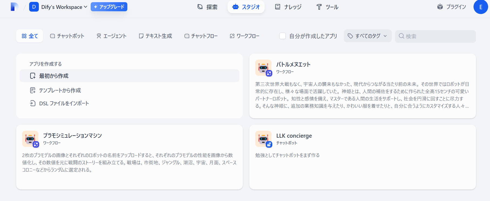

## ワークフローを選択
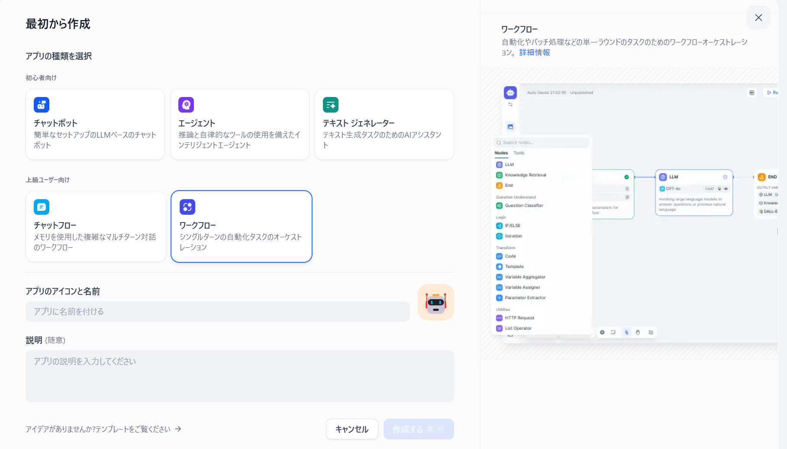

## アプリ名を設定
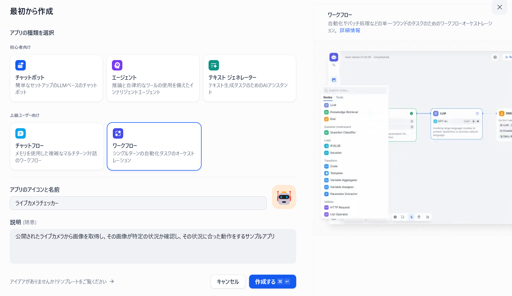

## スタジオでの編集開始
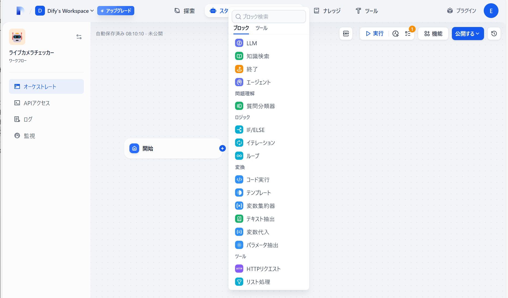

## 処理ブロックでツールのWebScraperを選択
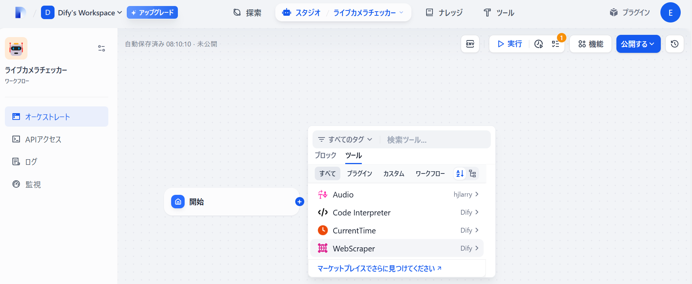

## WebScraperの設定画面を選ぶ
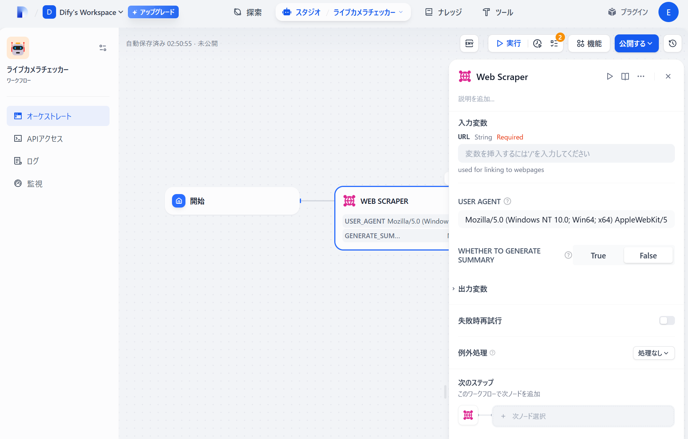

## 川俣ダム ライブ映像表示ページを開く

[ダム上流１カメラ（上流カメラ）](https://www.ktr.mlit.go.jp/kinudamu/daminfo/jp/cctv_C101.html)

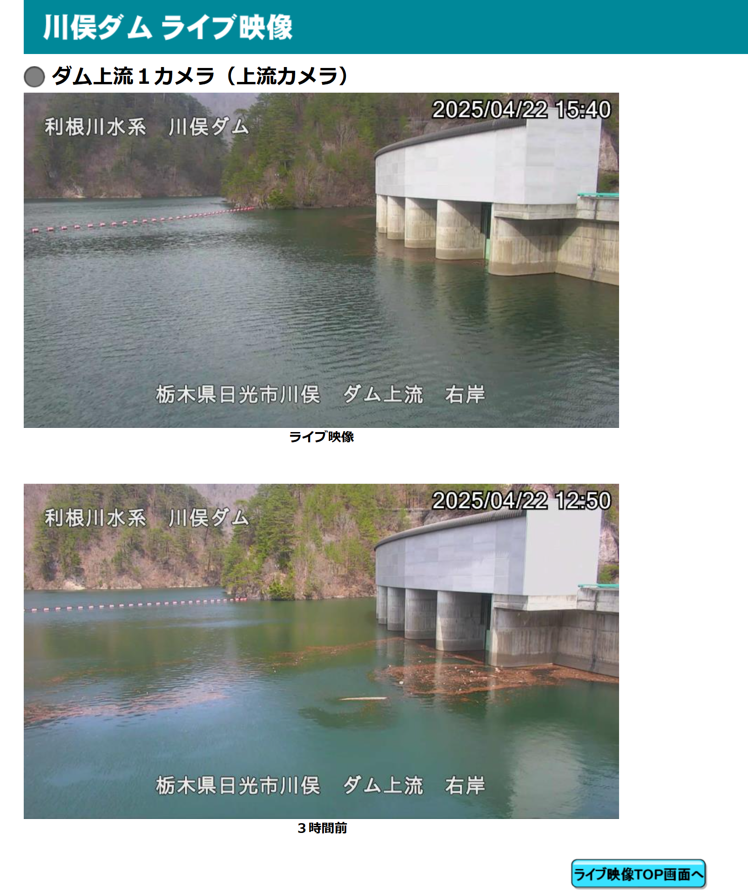

## LLMボックスを追加

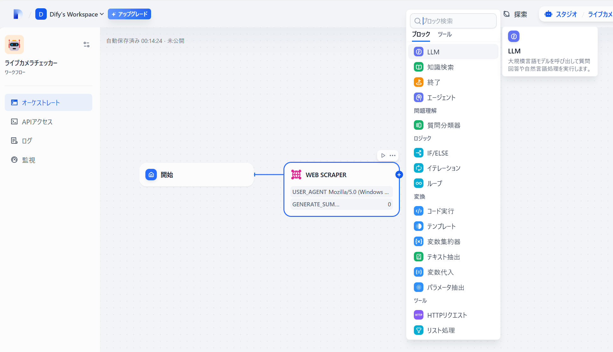

## プラグインでLLMを呼び出せるようにする

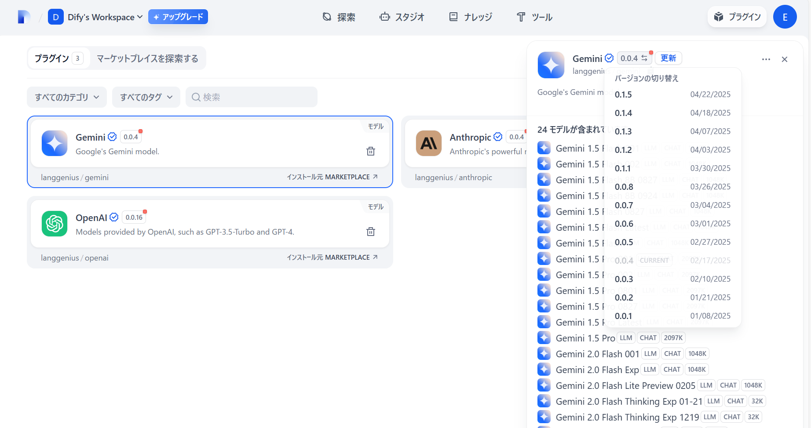

## 画像処理したいので vision 対応モデルを選択

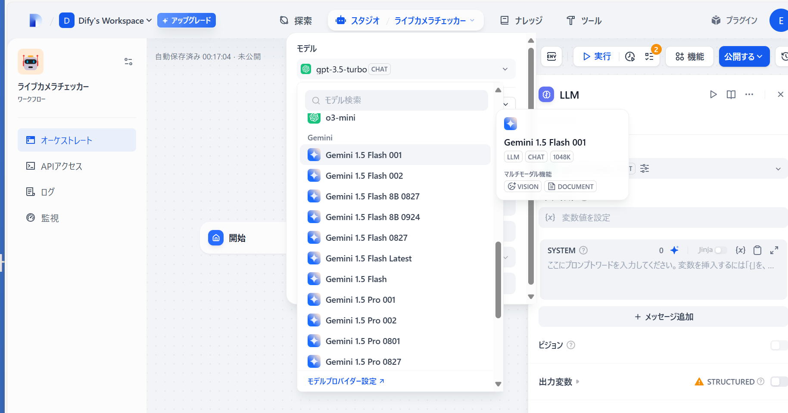

## Vision入力にweb scraperの出力ファイルを指定

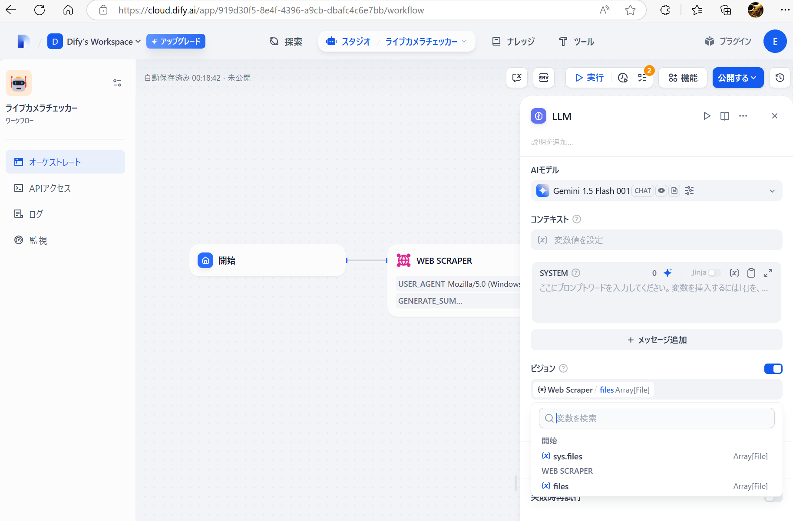

## 出力形式を指定

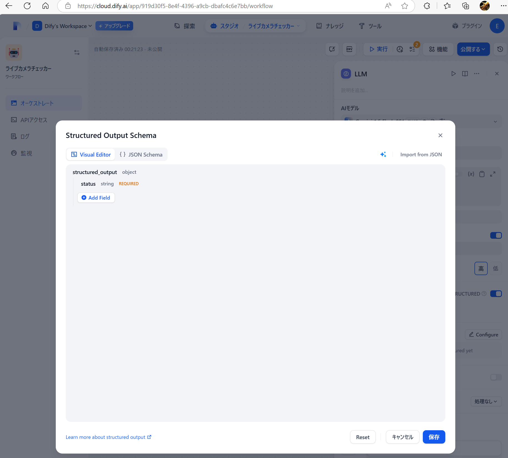

## プロンプトを設定

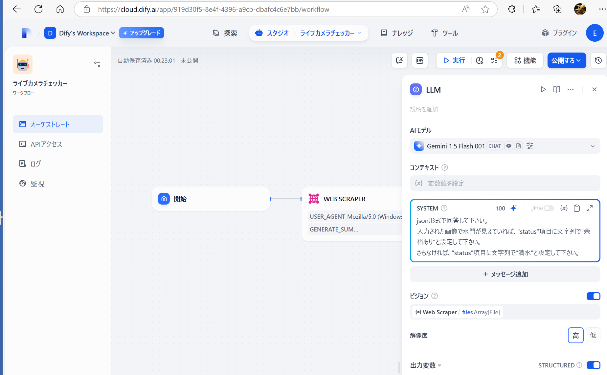

## 条件分岐ブロックを設定

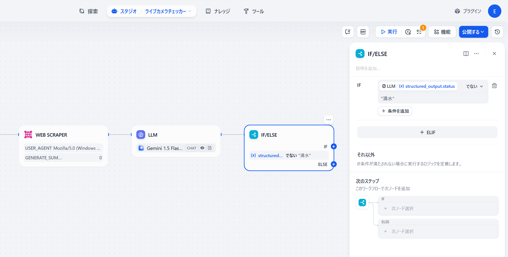

## やりたい処理(httpリクエスト)の設定と終了

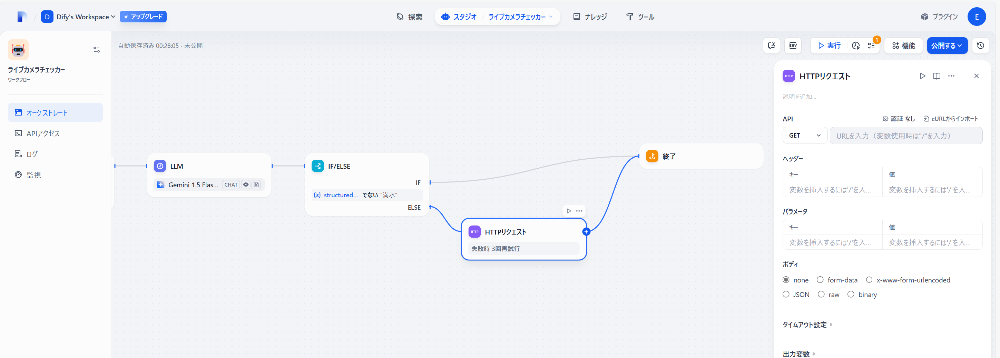